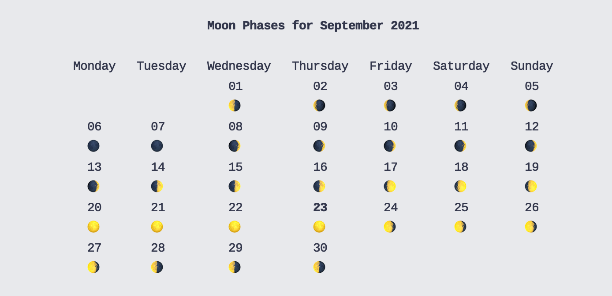
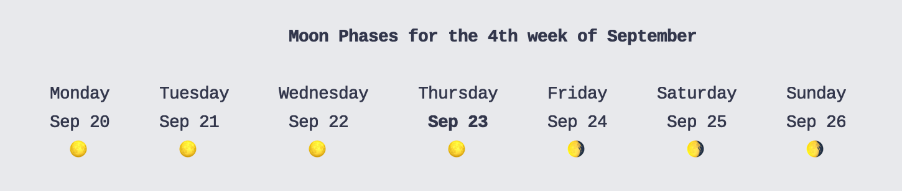
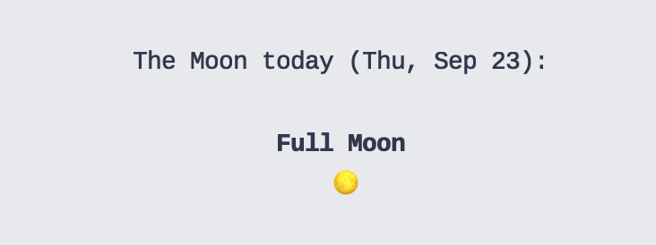

# 🌚 MOON 🌝

A naive lil' terminal moon-phase calendar built with Ruby and TTY as an exercise in learning how to create Gems, and distribute releases via Homebrew.

## Installation

```bash
brew install nikokozak/formulas/moon
```

Or

```bash
gem install mooncal
```

## Usage

### Display a monthly calendar:

```bash
moon
```
or 
```bash
moon month
```



### Display a weekly calendar:

```bash
moon week
```



### Display a daily calendar:

```bash
moon day
```



### Uninstall

Depending on the installation method:

With homebrew:
```bash
brew uninstall moon
brew clean
```

Gems:
```bash
gem uninstall mooncal
```

### License

MIT
